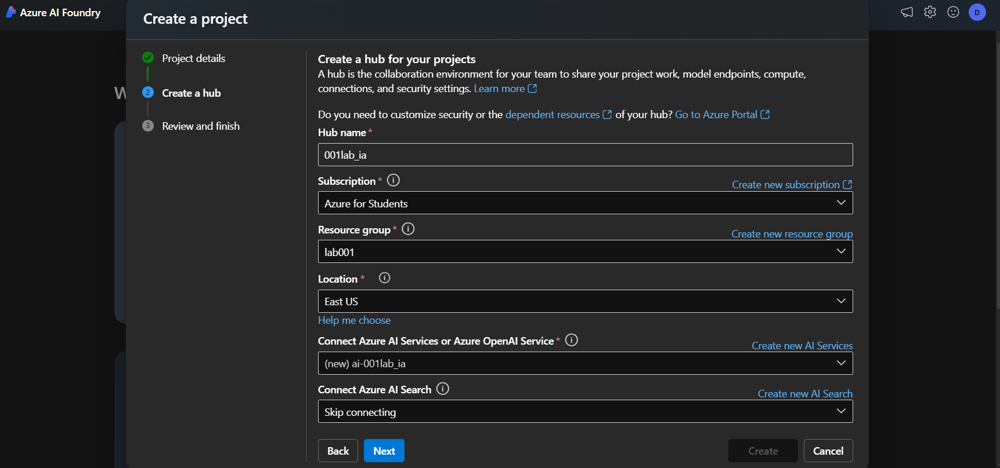
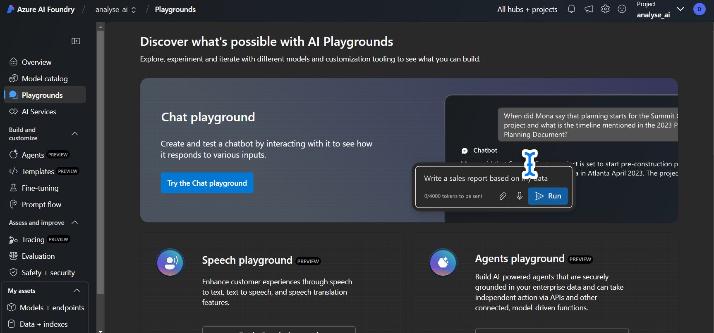
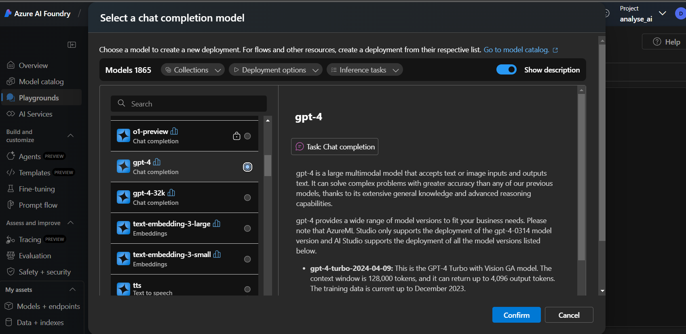
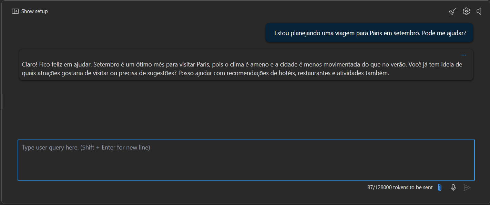
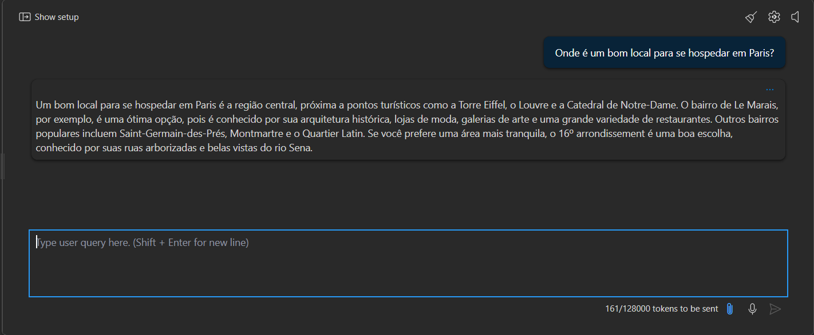
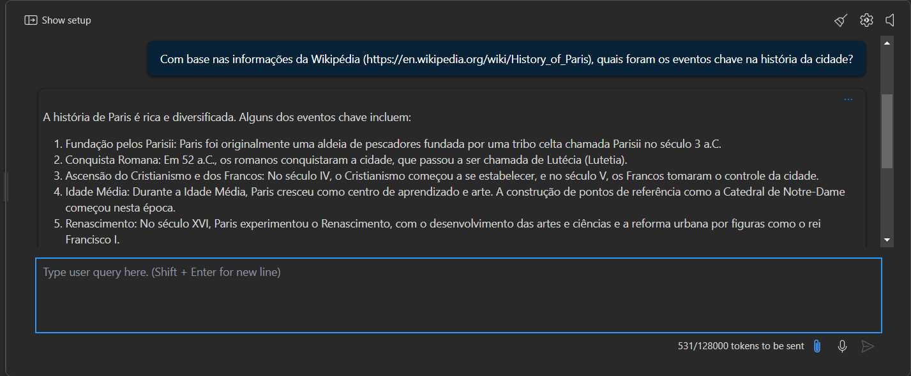
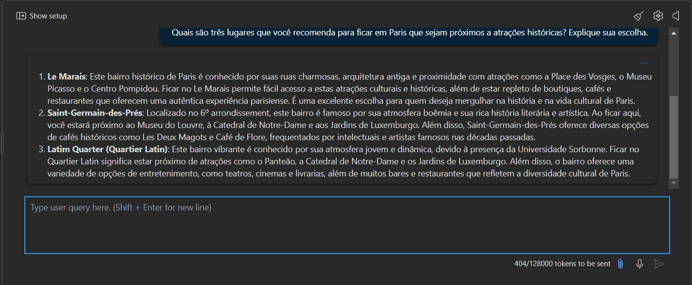
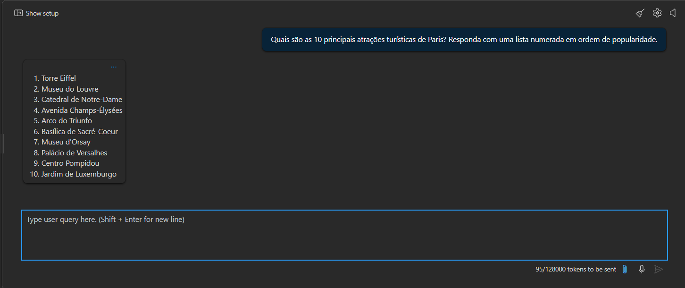

# Projeto de Chat no Azure AI Foundry

Este repositório contém um guia passo a passo para a criação de um projeto no Azure AI Foundry, explorando o playground de Chat e testando respostas geradas por IA. Siga as instruções para fazer o deploy do GPT-4 e interagir com ele para refinar as respostas para diversos cenários de uso.


## Links importantes

- [Azure AI Foundry](https://portal.azure.com)
- [Explore generative AI with Microsoft Copilot](https://microsoftlearning.github.io/mslearn-ai-fundamentals/Instructions/Labs/12-generative-ai.html)
- [Explore content filters in Azure OpenAI](https://microsoftlearning.github.io/mslearn-ai-studio/Instructions/06-Explore-content-filters.html)

## Pré-requisitos

Para realizar este projeto, é necessário ter uma conta Microsoft e criar um projeto no Azure AI Foundry

## Passos para Criar o Projeto

1.  **Criar um novo projeto**
   - Na página inicial do Azure AI Foundry, selecione "Criar um projeto".
   - Na aba de criação do projeto, mantenha o nome gerado automaticamente, para o projeto coloquei 001lab_ia
   - Selecione **Criar novo hub**, insira um nome único para o hub e clique em "Próximo".
   - Selecione a opção **Customizar** e escolha uma das seguintes localizações: East US, France Central, Korea Central, West Europe, ou West US.
   - Clique em "Criar".
  
  

  Após conferir os dados, será iniciado o processo de criação de projeto, em alguns casos pode levar alguns minutos. Finalizando esse processo, voltamos para a pagina iniciar e clicamos no menu lateral o Playground.

2. **Interagir com o modelo de IA**
   
   - Na página de Playground, selecione "Try the Chat Playground".
  
   - No Playground de Chat, selecione "Create a deployment" e procure pelo modelo GPT-4.
  
   - No menu de Deploy do modelo, mantenha as seleções padrão e clique em "Deploy". 
   - Verifique o status do deployment no menu "Models and Endpoints".
  
  3. **Exemplos de prompts para gerar respostas**
   
   No exemplo da microsoft é utilizado frases em ingles, mas para teste, utilizem em portugues e o chat conseguiu retornar respostas.

- **Planejar uma viagem:**
     ```bash
     Estou planejando uma viagem para Paris em setembro. Pode me ajudar?
     ```




- **Locais para hospedagem:**
     ```bash
     Onde é um bom local para se hospedar em Paris?
     ```
 


- **Fornecer uma fonte de informações:**
     ```bash
     Com base nas informações da Wikipédia (https://en.wikipedia.org/wiki/History_of_Paris), quais foram os eventos chave na história da cidade?
     ```
 

- **Adicionar contexto para respostas mais relevantes:**
     ```bash
     Quais são três lugares que você recomenda para ficar em Paris que sejam próximos a atrações históricas? Explique sua escolha.
     ```
 

- **Definir expectativas claras para a resposta:**
     ```bash
     Quais são as 10 principais atrações turísticas de Paris? Responda com uma lista numerada em ordem de popularidade.
     ```
 


Após esse teste, para finalizar é só fechar a tela do navegador. 
